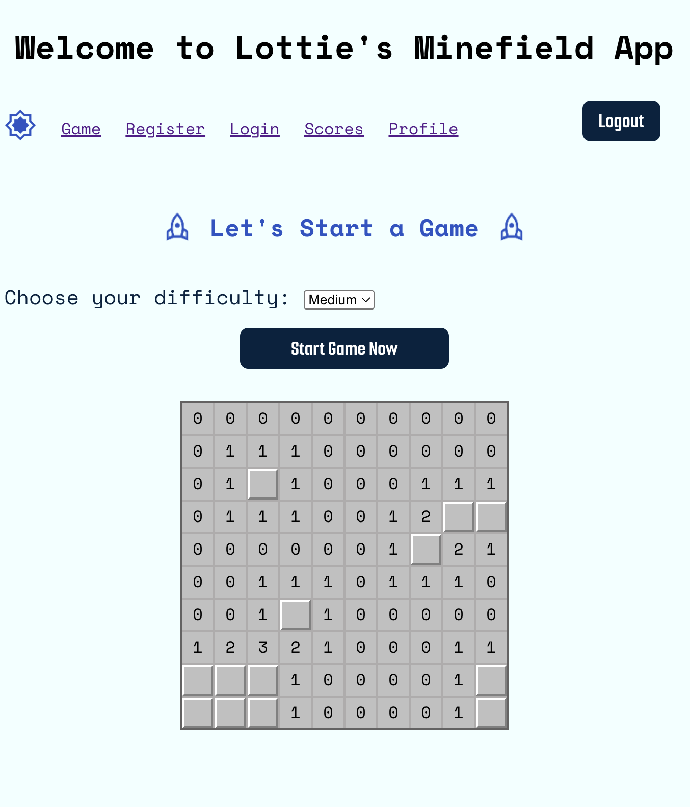

# 💣 Fullstack JS Minesweeper

A robust, fullstack implementation of the classic Minesweeper game. This project features a secure backend, persistent data storage, and multiple authentication methods, demonstrating a modern approach to web application security and state management.

---

**Live App:** [https://minefield-project-frontend.onrender.com/](https://minefield-project-frontend.onrender.com/)

**App Preview:**



---

## Requirements / Purpose

### Purpose

To modernize the classic Minesweeper experience while building a secure, full-stack web application with authentication and persistent game history.

### Tech Stack Used & Why

- **Frontend (React, ES6+, JS):** Component-driven client-side interface for responsive board state updates. Built for fast static delivery via `npx serve`.
- **Backend (Node.js & Express):** Lightweight, event-driven JavaScript backend sharing logic patterns with the frontend.
- **Database (PostgreSQL):** Structured relational storage ideal for query consistency, user accounts, and score histories.
- **Auth (Google OAuth 2.0 & Sessions):** Provides flexiblity with custom local sessions and quick third-party sign-ins.

---

## 🎮 How to Play

1.  **Set the Stage:** Select your desired difficulty level from the options menu.
2.  **Initialize:** Press the **Start Game** button to generate the board.
3.  **Objective:** Clear every cell on the board that does not contain a mine.
4.  **Strategy:**
    - **Click** a cell to reveal what’s underneath.
    - **Numbers** indicate how many mines are touching that specific cell.
5.  **Win Condition:** The game is won once all safe cells are revealed and only the mines remain hidden.

---

## ✨ Features

- **Dynamic Gameplay:** Core Minesweeper game logic including board generation, proximity calculations, and win/loss state detection.
- **Dual Authentication System:**
  - **Local Auth:** Custom account creation and session-based login.
  - **OAuth 2.0:** Integrated **Google 3rd-party API** for seamless sign-in.
- **User Profiles:** Dedicated dashboard to review and update personal profile details.
- **Persistent Scoring:** Game results are saved to a database, allowing users to retrieve and track their historical scores.
- **Security Architecture:**
  - **Protected Routes:** Sensitive account data is shielded by custom authentication middleware.
  - **Database Security:** All queries use **prepared statements** to prevent SQL injection.
  - **Data Validation:** Strict validation for all incoming database requests.

---

## 🚀 Installation & Setup

### 1. Environment Configuration

Create a `.env` file in your backend directory to manage your secrets:

```env
NODE_ENV=production
GOOGLE_CLIENT_ID=your_google_client_id
GOOGLE_CLIENT_SECRET=your_google_client_secret
DATABASE_URL=your_db_url
```

---

### 2. Backend setup

#### Navigate to the backend directory

```
cd backend
```

#### Install dependencies

```
npm install
```

#### Start the server

```
node index.js
```

---

### 3. Frontend setup

#### Navigate to the frontend directory

```
cd frontend
```

#### Install dependencies and build the production bundle

```
npm install && NODE_ENV=production npm run build
```

#### Serve the build folder

```
npx serve -s build
```

---

### 4. Database setup

1. Initialize a clean PostgreSQL database instance.
2. Run the queries contained in the database file: `database_create_queries.sql`

---

## Design Goals / Approach

- **Security First:** Implemented custom middleware for protected routes and parameterized SQL statements to defend against injection attacks.
- **State Separation:** Decoupled frontend rendering logic from session management handled on the server.
- **Seamless Auth:** Built an integrated authentication pipeline supporting both standard credentials and OAuth 2.0 without sacrificing user experience.

---

## Known Issues

- Session persistence in incognito mode is currently unsupported due to third-party cookie restrictions.
- Ongoing component refactoring to align closer with advanced React best practices.

---

## What Did You Struggle With?

- **OAuth Middleware Syncing:** Integrating Google OAuth alongside standard session-based auth required careful handling of session cookies to ensure unified user state across routes.
- **CORS & Browser Cookies:** Resolving Cross-Origin Resource Sharing (CORS) rules for cross-domain cookie exchange. While API requests worked cleanly in Postman, configuring credentials and headers for browser security policies required extensive debugging.

---

## Future Goals

- **Cell Flagging:** Implement right-click functionality allowing players to place visual flags on suspected mine locations.
- **Global Leaderboard & Social Features:** Add competitive leaderboards sorted by completion time, W/L ratio, and difficulty, alongside user profiles to compare high scores.
- **Keyboard Accessibility:** Introduce full keyboard navigation (`Tab` focus, `Enter`/`Space` triggers) so players can navigate and reveal cells without requiring a mouse.
- **React Component Refactoring:** Restructure custom UI components to leverage modern React patterns (hooks optimization, cleaner state separation, and improved render performance).
- **Incognito Session Handling:** Research alternative state persistence strategies (such as token-based auth stored in `localStorage`) to handle guest or incognito browser sessions where third-party cookies are blocked by default.

---

## 📜 License

- This project is licensed under the MIT License.

- Summary: You can do almost anything you want with this software as long as you provide attribution back to the author and don’t hold them liable. It is one of the most popular licenses for open-source and portfolio projects.

---

## Further Details, Related Projects, Reimplementations

- **Client/API Architecture:** The `frontend` client build communicates directly with the `backend` REST API. If running headless, the backend API can be repurposed for standalone CLI or mobile clients.
